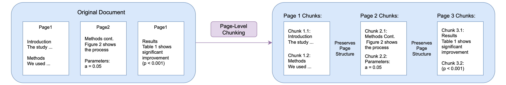

# Optimizing Multimodal RAG for Document Question Answering
**Computational Efficiency and Answer Quality Analysis for Multimodal Document QA**

## 🔍 Problem Statement
Modern document question-answering systems increasingly rely on **Retrieval-Augmented Generation (RAG).**
However, most evaluations focus only on **answer accuracy**, overlooking two critical data science questions:
> **How do design choices affect runtime, scalability, and error patterns?  
> Do faster systems necessarily sacrifice answer quality?**

This project studies these questions using VisDoMRAG, a multimodal RAG system that answers questions over PDFs by combining text and visual information (tables, charts, slides).

## 🧩 System Overview
The system follows a **multimodal RAG architecture,** where textual and visual evidence are retrieved separately from PDF documents and fused to generate final answers.
This design enables reasoning over heterogeneous document content such as paragraphs, tables, figures, and slides.

## 🧱 Chunking Strategies Compared
This project treats **chunking as a modeling design choice** rather than a fixed preprocessing step.
Two chunking strategies are compared, each with different implications for runtime, scalability, and answer quality:

* Document-level chunking: pages are merged before segmentation, allowing cross-page context but requiring metadata recovery

* Page-level chunking: chunks are created within page boundaries, preserving metadata by design and reducing overhead

## 🎯 Data Science Objectives
1. Quantify trade-offs between computational efficiency and answer quality
2. Compare chunking strategies as a modeling design choice
3. Evaluate multiple LLM backbones under controlled experimental settings
4. Move beyond single metrics using structured error analysis
5. Produce actionable recommendations based on data characteristics

## 🧪 Experimental Design
A controlled, multi-stage experiment was conducted on **VisDoMBench**, a large-scale multimodal QA benchmark:
| Dataset Type   | Examples                       |
| -------------- | ------------------------------ |
| Text & Tables  | Scientific papers              |
| Charts         | Graph-heavy documents          |
| Slides         | Presentation decks             |
| Multi-document | Avg. 8+ documents per question |

**Compared Pipelines**

* **Baseline**: Original VisDoMRAG implementation

* **Variant 1 (V1)**: Optimized execution with identical logic

* **Variant 2 (V2)**: Alternative chunking strategy (page-level)

All experiments were run under **consistent evaluation conditions**, enabling fair comparisons.

## 📐 Evaluation Metrics
**Primary Metric**

* Word-Overlap F1

  * Chosen for consistency with existing benchmarks

  * Interpreted cautiously due to lexical sensitivity

**Supplementary Analysis**
* Pipeline runtime profiling
* Chunk count comparisons
* Fine-grained error categorization, including:
  * Insufficient evidence
  * Entity/attribute mismatch
  * Off-topic or incomplete answers

This combination allowed both **quantitative comparison** and **qualitative insight.**

## 📊 Key Findings
1️⃣ **Efficiency vs Accuracy Is Not a Zero-Sum Game**
* Large runtime improvements (up to 98–99%) were achieved
* Answer quality remained stable or improved, depending on dataset

📌 Insight: Smart design choices can drastically improve scalability without harming performance.

2️⃣ **Chunking Strategy Matters More Than Expected**
| Dataset Characteristics          | Best Strategy           |
| -------------------------------- | ----------------------- |
| Text-dense, cross-page reasoning | Document-level chunking |
| Visual-heavy or sparse text      | Page-level chunking     |

📌 Insight: There is **no universal best strategy**: data properties should drive design decisions.

3️⃣ **Model Choice Strongly Affects Outcomes**
* Llama-3-70B consistently outperformed Gemini-1.5-Flash
* F1 improvements ranged from +3% to +53% depending on dataset

📌 Insight: Backbone selection can outweigh architectural tweaks in downstream performance.

4️⃣ **Metric Limitations Revealed by Error Analysis**
* Many low-F1 responses were:
  * Semantically correct but verbose
  * Correct but paraphrased
* Conservative refusal behavior masked true performance in some models

📌 Insight: Aggregate metrics alone can misrepresent real system behavior.

## 🧠 What This Project Demonstrates (Data Science Skills)
* Experimental design & controlled comparison
* Model evaluation across heterogeneous datasets
* Metric interpretation & limitations
* Error analysis and failure mode diagnosis
* Translating results into practical recommendations

This project emphasizes **reasoning from evidence,** not system-level optimization.

## 🛠 Tools & Methods (High-Level)
* Python (data processing & experimentation)
* Multimodal RAG pipelines
* Vector-based retrieval
* LLM-based QA systems
* Quantitative & qualitative evaluation

## 📂 Code Overview
This repository contains:
* Baseline and optimized VisDoMRAG pipeline variants
* Scripts used for runtime measurement and performance comparison
* Error analysis code for categorizing and interpreting model failures

The code is provided to support the analysis and results presented above,
rather than as a fully packaged or production-ready system.

## 🔗 Acknowledgement & Prior Work
This project builds on the **VisDoM / VisDoMRAG** framework and benchmark introduced in:

* **VisDoM: Multi-Document QA with Visually Rich Elements Using Multimodal RAG**
* Official GitHub repository: https://github.com/MananSuri27/VisDoM/

The original VisDoM work provides the baseline multimodal RAG architecture and
the **VisDoMBench** evaluation benchmark.
All experimental design, pipeline variants, runtime analysis, chunking strategy
comparisons, and result interpretation in this repository were conducted by me
as part of this project.

## 📄 Dissertation
📘 **Full dissertation:**  
[COMP0158_MWRP3.pdf](COMP0158_MWRP3.pdf)

## 👤 Author
**Ruoxue Wang**
MSc Data Science & Machine Learning — UCL
📍 London, UK